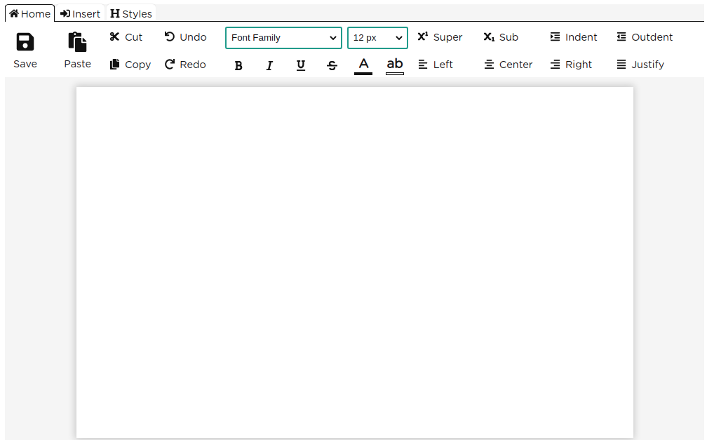
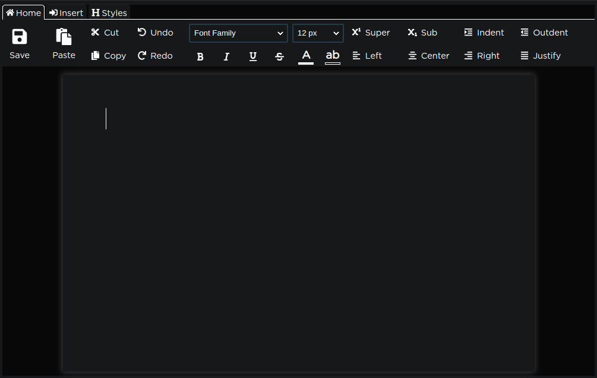
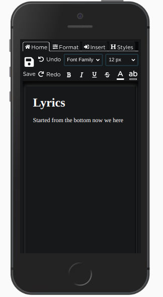

# aSoft Office

![badge][badge-maven] ![badge][badge-mpp] ![badge][badge-android] ![badge][badge-js] ![badge][badge-jvm]

Get a kotlin suite of kotlin office tools for free

## Artifacts

- [x] office-word-core
- [x] office-word-browser
- [x] office-word-react
- [ ] office-word-compose
- [ ] office-presentation-core
- [ ] office-presentation-browser
- [ ] office-presentation-react
- [ ] office-sheet-core
- [ ] office-sheet-browser
- [ ] office-sheet-react

## Setup: Gradle

```kotlin
dependencies {
    implementation("tz.co.asoft:office-word-react:0.0.10") //
}
```

## Sample

### Code

```kotlin
WordEditor(
    onSave = { word -> window.alert(word) }
)
```

### Desktop Output



### Desktop Output | Dark Mode



### Code

```kotlin
WordEditor(
    content = "<h1>Lyrics</h1><p>Started from the bottom now we here</p>",
    onSave = { word -> window.alert(word) }
)
```

### Mobile Output



[badge-maven]: https://img.shields.io/maven-central/v/tz.co.asoft/office-word-core/0.0.10?style=flat

[badge-mpp]: https://img.shields.io/badge/kotlin-multiplatform-blue?style=flat

[badge-android]: http://img.shields.io/badge/platform-android-brightgreen.svg?style=flat

[badge-js]: http://img.shields.io/badge/platform-js-yellow.svg?style=flat

[badge-jvm]: http://img.shields.io/badge/platform-jvm-orange.svg?style=flat
